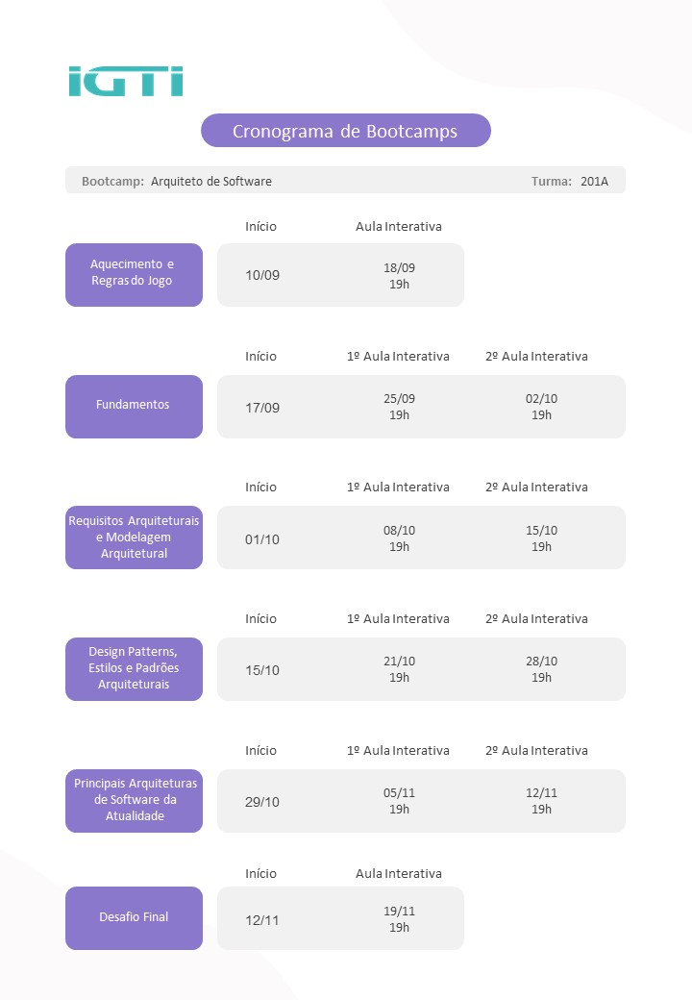

<h1 align="center">
    BAS
</h1>

<h3 align="center">
    Repository created for the storage of IGTI Bootcamp Files
</h3>

“Arquitetura é a estrutura dos componentes de um sistema, seus inter-relacionamentos, princípios e diretrizes que guiam o desenho e evolução ao longo do tempo” (BASS, CLEMENTS, KAZMAN).

    

    

    

